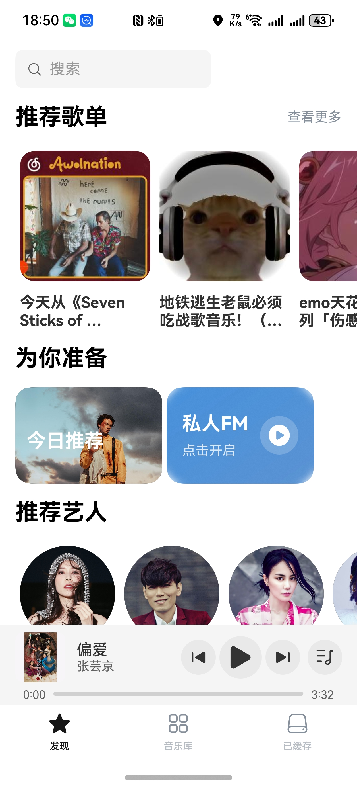
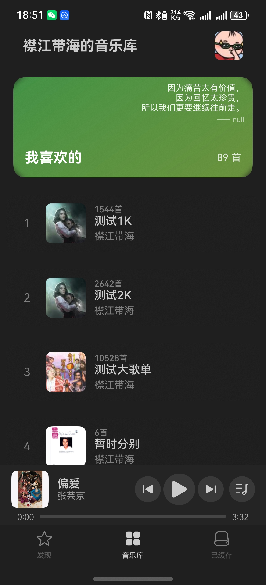

# NetEase Cloud Music Third-party Client

[English](README_en.md) | [中文](README.md)

## Preview

    
    

## Introduction
This is a third-party NetEase Cloud Music client based on HarmonyOS Next API 12. It provides a smooth and native experience while maintaining all the essential features you love from the original app.

## Features
- **Multiple Login Methods**
  - QR Code scanning
  - Official web QR code
  - Email login
  - Phone number login
- **Core Music Features**
  - Playlist management (create/collect)
  - Song and playlist search
  - Heartbeat mode and Personal FM
  - Access to created and collected playlists
  - Add songs to favorites
  - Create new playlists
- **Additional Features**
  - Sleep timer
  - Dark mode support
  - Custom font support
  - Adaptive layout for both tablets and phones

## Technical Details
- Platform: HarmonyOS Next
- API Version: 12

## Contributing
We welcome contributions from the community! Whether it's:
- Bug reports
- Feature requests
- Code contributions
- Documentation improvements

Feel free to submit issues and pull requests. Let's make this client better together!

## License
MIT License

Copyright (c) 2024 Okysu

Permission is hereby granted, free of charge, to any person obtaining a copy
of this software and associated documentation files (the "Software"), to deal
in the Software without restriction, including without limitation the rights
to use, copy, modify, merge, publish, distribute, sublicense, and/or sell
copies of the Software, and to permit persons to whom the Software is
furnished to do so, subject to the following conditions:

The above copyright notice and this permission notice shall be included in all
copies or substantial portions of the Software.

THE SOFTWARE IS PROVIDED "AS IS", WITHOUT WARRANTY OF ANY KIND, EXPRESS OR
IMPLIED, INCLUDING BUT NOT LIMITED TO THE WARRANTIES OF MERCHANTABILITY,
FITNESS FOR A PARTICULAR PURPOSE AND NONINFRINGEMENT. IN NO EVENT SHALL THE
AUTHORS OR COPYRIGHT HOLDERS BE LIABLE FOR ANY CLAIM, DAMAGES OR OTHER
LIABILITY, WHETHER IN AN ACTION OF CONTRACT, TORT OR OTHERWISE, ARISING FROM,
OUT OF OR IN CONNECTION WITH THE SOFTWARE OR THE USE OR OTHER DEALINGS IN THE
SOFTWARE.